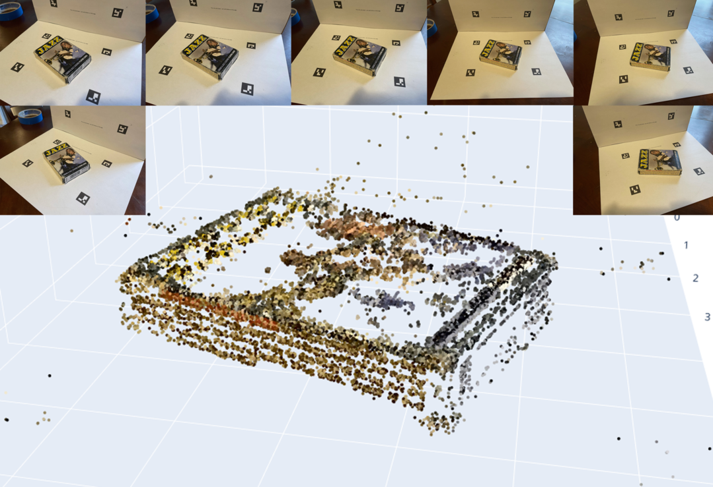
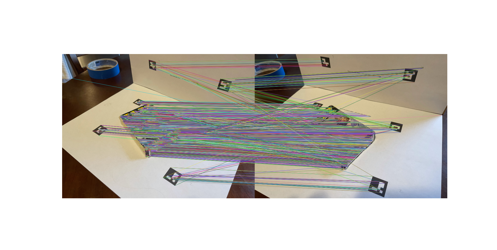
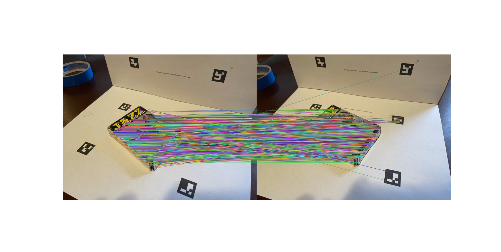
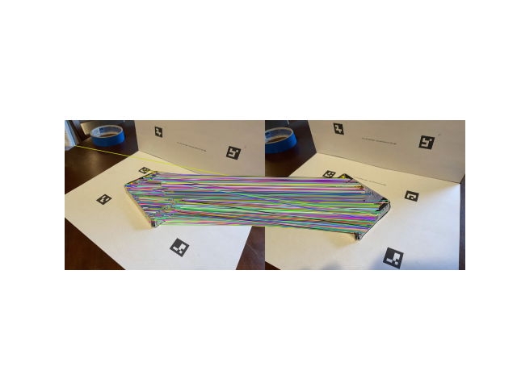
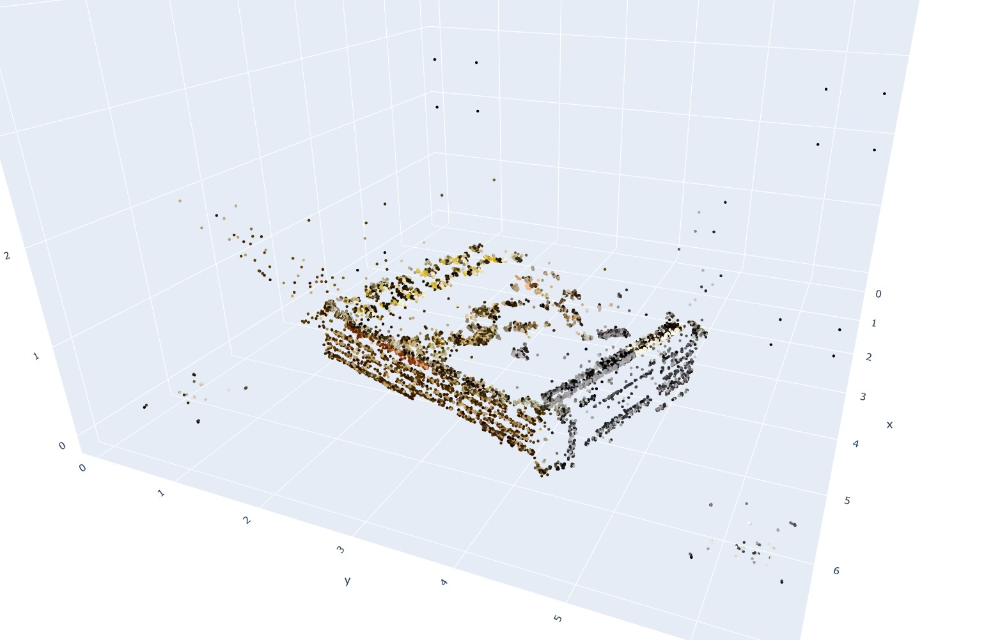

# Point Cloud Scene Reconstruction
This is a program that reconstructs a point cloud of a scene given multi-view images using stereo & epipolar geometry. 

## Implementation Details
In my implementation of RANSAC (used to estimate the best fundamental matrix), I used the distance of $x^TFx^′$ from 0 as the distance
metric and a threshold of 0.025 (found empirically). I used least squares in matches_to_3d
to estimate the 3D points in the scene and SVD in estimate fundamental matrix to
estimate F using 2D image point correspondences. In both bases, I expressed the systems
of equations in the form $Ax = b$ and solved for the unknown parameters in $x$.

## Observations & Results
When tuning the hyperparameters for RANSAC, I noticed that the percentage of inliers
over the entire point set was highly sensitive to the threshold. When I started with a high
threshold (0.3), almost all point correspondences were retained as inliers after running
RANSAC, meaning many of the spurious matches were passed into the fundamental matrix estimator.
With a very low threshold of 0.001, however, only a small handful of the strongest
correspondences remained inliers. 

I also noticed that most of these strong matches were
along the lower half of the book in the input images. The sweet spot I found was at around 0.025, where
there was still some noise but almost all important matches were kept as inliers.
It was clear that increasing the number of iterations in RANSAC increased the inlier
percentage. However, for almost all image pairs, increasing the number of iterations past
500 resulted in few increases to the best inlier percentage, as the optimal ones are found
within the first few hundred iterations.

Before RANSAC

After 50 iterations of RANSAC at 0.025 threshold:

After 500 iterations of RANSAC at 0.025 threshold:

Final point cloud reconstruction:

